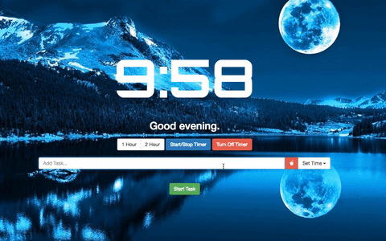
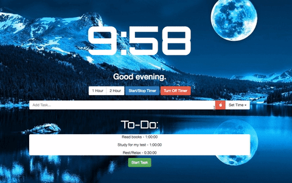

# Clocky
A simple timer-meets-todo-list to help you manage your time and be productive. Inspired by the Momentum chrome extension.


### Features
- Clock: Displays current time of day.
- Timer: Create quick 1 or 2 hour timers.
- Task List: Fill in the form with a task and assign how long you would like to spend on this particular task. At the end of the timer, Clocky will notify you that your task timer is complete. Included is a quick pomodoro timer button (25 minutes).





### How to install (Chrome Extension)
1. Download Clocky.crx
2. Navigate to ```chrome://extensions```
3. Drag and drop Clocky.crx onto the page and click 'Add Extension'.
4. Open a new tab.
